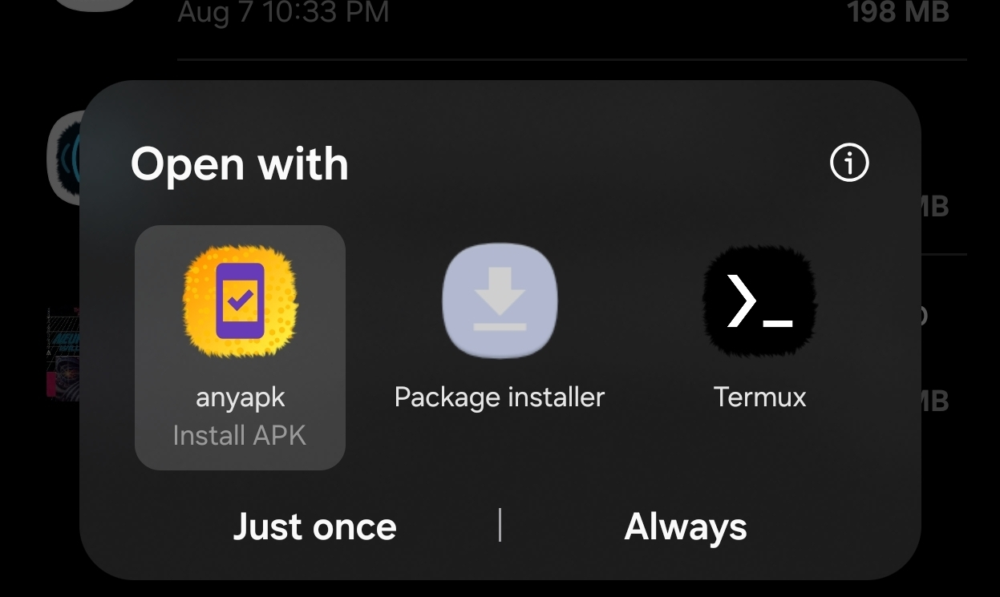
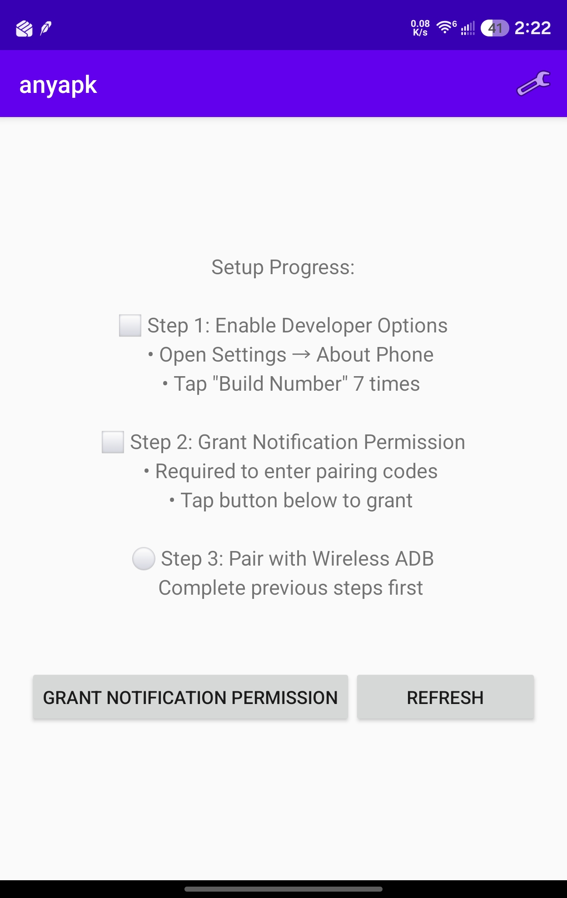
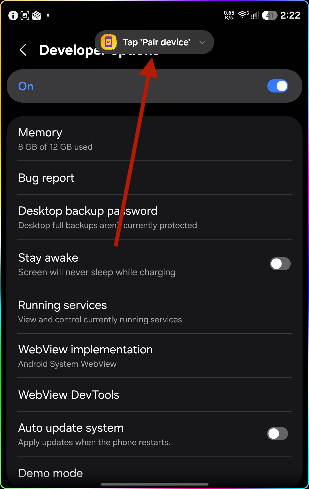
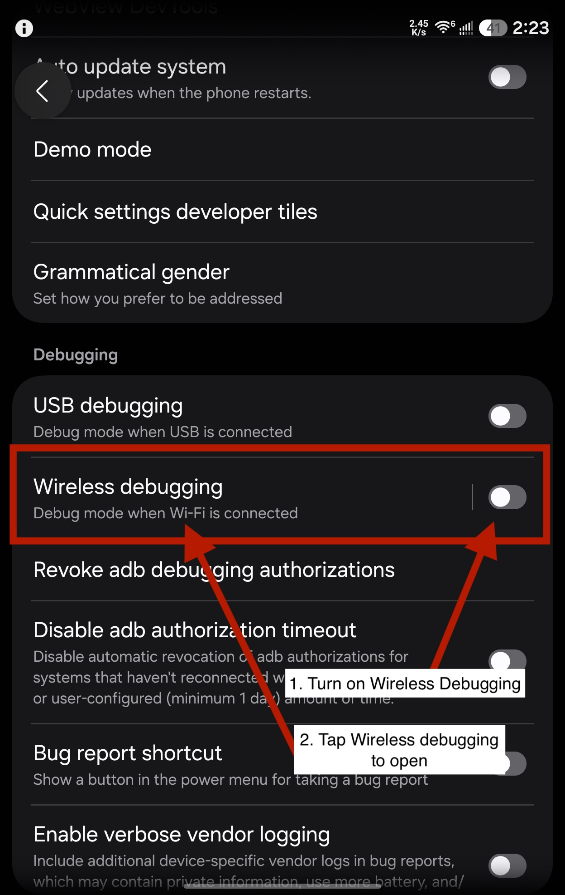
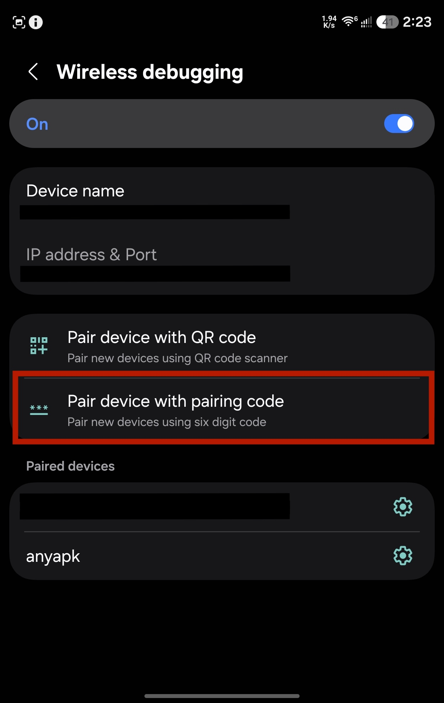
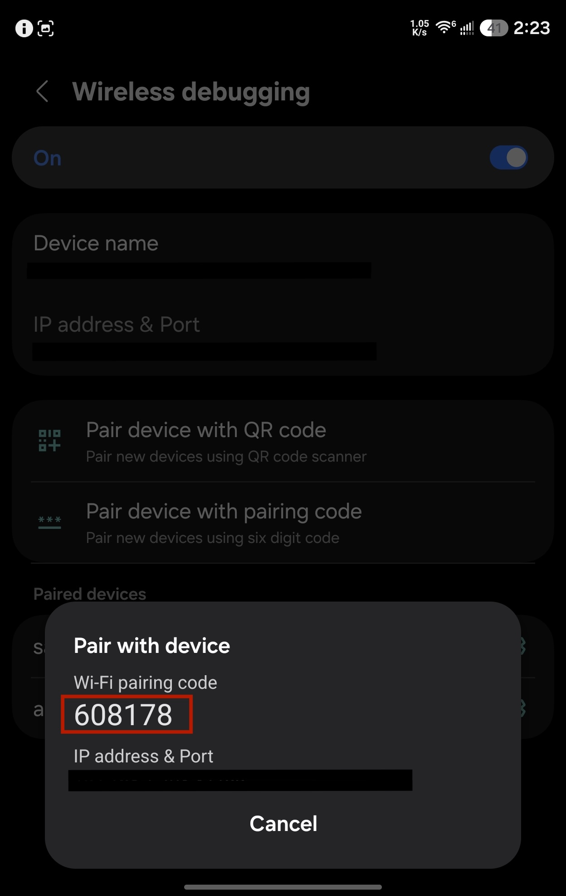
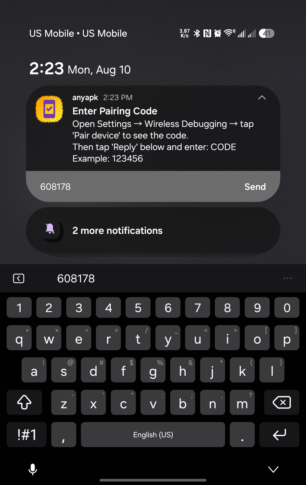

<p align="center">
  
</p>

# anyapk

**Bypass Google And Install Any APK You Want On The Device You Own.**

[Website](https://sam1am.github.io/anyapk/) · [Releases](https://github.com/sam1am/anyapk/releases)

anyapk is a lightweight Android application installer that bypasses Google's developer verification requirements by using local ADB (Android Debug Bridge) connections. Smoothly install any APK file on your device without restrictions, gatekeepers, or corporate approval.

<p align="center">
  
  <br>
  <em>Open any APK, pick anyapk instead of the Package installer, and it installs.</em>
</p>

## Why We Made This

Android devices belong to their users, not corporations or governments. Yet with each passing year, installing applications on your own device becomes more restricted, more cumbersome, and more dependent on the approval of gatekeepers who do not have your best interests at heart.

anyapk returns control to where it belongs: in your hands.

## Manifesto: Application Freedom

When a corporation becomes a gatekeeper, they don't stand alone at the gate. Their partners become gatekeepers. Government jurisdictions become gatekeepers. And suddenly, what began as a "quality control measure" transforms into a lever of control.

This lever has been used by repressive governments to deny citizens access to free communication tools. It has been used to block applications that challenge power structures. It has been used to enforce geographic restrictions that serve business interests rather than user needs.

**Application freedom is user freedom.**

Every barrier placed between you and the software you choose to run is a barrier to your digital autonomy. Every verification requirement is a chokepoint where control can be exercised. Every "safety measure" that requires corporate or governmental approval is a potential tool of censorship.

We built anyapk because we believe:
- Your device belongs to you
- You have the right to run any software you choose
- No corporation or government should stand between you and that choice
- Technical barriers to freedom must be removed, not accepted

If you believe software should serve users rather than control them, anyapk is for you.

Anyapk is not a solution to the problem - it's a tool that helps you bypass the problem. A real solution is competent government regulation that protects users from unfair and anti-competitive lockdown practices. Learn more about how Google is restricting your freedoms and how you can fight back at [keepandroidopen.org](https://keepandroidopen.org/).

## Features

- **One-time pairing**: Pair once using wireless debugging — no need to re-pair after reboots (you'll just need to re-enable wireless debugging itself, since Android turns it off on reboot)
- **Pair from the notification shade**: Reply to a notification with the pairing code — no split-screen gymnastics
- **No root required**: Uses Android's built-in wireless ADB
- **No external dependencies**: Everything runs locally on your device
- **System-wide integration**: Register as an APK handler to install from any file manager
- **Split bundles too**: `.apks`, `.apkm` and `.xapk` install as a single session, with only the splits your device actually needs
- **Expansion files**: `.obb` files are copied into place over ADB, including the ones bundled inside an `.xapk`
- **Direct file selection**: Built-in file picker if you don't have a file manager handy
- **Self-updating**: Optionally checks GitHub releases and installs new versions over the same ADB connection

## Installation

### Method 1: Install via APK (Recommended)

1. Download the latest APK from the [Releases](../../releases) page. There is one build per
   CPU architecture — take `arm64-v8a` unless you know otherwise, since it covers virtually
   every phone made in the last decade:

   | File | For |
   | --- | --- |
   | `anyapk-<version>-arm64-v8a.apk` | Almost all phones and tablets |
   | `anyapk-<version>-armeabi-v7a.apk` | Older 32-bit devices |
   | `anyapk-<version>-x86_64.apk` | Emulators, x86 Chromebooks |
   | `anyapk-<version>-universal.apk` | Works everywhere, roughly twice the size |

2. Open the APK file on your device
3. Grant installation permissions if prompted
4. Welcome to application freedom

Once installed, anyapk's self-updater picks the right build for your device on its own.

### Method 2: Install via ADB (The Last Time)

If you can't install the APK directly (due to existing restrictions), use ADB from your computer. This is the last time you'll need to do this the hard way.

**Prerequisites:**
- A computer with ADB installed ([Download SDK Platform Tools](https://developer.android.com/studio/releases/platform-tools))
- A USB cable

**Steps:**
1. Enable Developer Options on your device:
   - Go to **Settings → About Phone**
   - Tap **Build Number** 7 times until you see "You are now a developer!"

2. Enable USB Debugging:
   - Go to **Settings → Developer Options**
   - Enable **USB debugging**

3. Connect your device to your computer via USB

4. Install anyapk using ADB:
   ```bash
   adb install anyapk-<version>-arm64-v8a.apk
   ```

5. You're done! You won't need ADB from your computer again.

## Setup & Usage

### First-Time Setup

### 1. Enable Developer Options

- Open **Settings → About Phone**
- Tap **Build Number** 7 times
- You'll see "You are now a developer!"

### 2. Grant notification permission (Android 13+)

- Open anyapk. The checklist shows what's still missing — tap **Grant Notification Permission**
- This is how you'll type the pairing code, so it's required, not optional



### 3. Pair with wireless ADB

1. Tap **Start Pairing**. anyapk posts a pairing notification and opens Developer Options for you.

   

2. Scroll to the **Debugging** section, turn on **Wireless debugging**, then tap the row to open it. Approve your WiFi network if prompted.

   

3. Tap **Pair device with pairing code** — not the QR code option.

   

4. A dialog shows your 6-digit pairing code. Don't dismiss it and don't leave Settings.

   

   > [!IMPORTANT]
   > The pairing code dialog must stay open and visible behind the notification shade the whole time. Android only advertises the pairing service while that dialog is on screen — if you close it or back out of Settings to switch to anyapk, the code dies with it and pairing will fail. Pull the shade down *over* the dialog; don't leave the screen.

5. Pull down the notification shade, find the anyapk notification, tap **Reply**, type the 6 digits, and send. anyapk pairs and pulls itself back to the foreground.

   

6. Approve the **"Allow USB debugging?"** prompt — check **"Always allow from this computer"** and tap **Allow**. If no prompt appears, tap **Test Connection** in anyapk to trigger it.

That's it! anyapk is paired and ready to use.

> **Note on persistence:** Android turns **Wireless debugging** off automatically when the device reboots. After a reboot, just flip it back on in Developer Options — you won't need to re-pair, since anyapk stays in the **Paired devices** list. If anyapk goes unused for a long stretch, Android may also drop it from that list; if that happens, repeat the pairing steps above.

### Installing APK Files

Once paired, installing APK files is effortless:

#### Method 1: From Any File Manager
1. Open any APK or bundle file in your file manager, browser, or download folder
2. In the **Open with** chooser, pick **anyapk** instead of the system Package installer
3. Tap **Just once**, or **Always** to make anyapk your default APK handler
4. Tap **Install**
5. Done!


#### Method 2: Using anyapk's Built-in Picker
1. Open anyapk
2. Tap **Select a File to Install**
3. Browse and select your APK file
4. Tap **Install**
5. Done!

### Supported File Types

| Format | What it is | What anyapk does |
| --- | --- | --- |
| `.apk` | A single app package | Installs it |
| `.apks` | An APK set from bundletool or SAI | Installs the base plus the splits that match this device |
| `.apkm` | APKMirror's bundle | Same |
| `.xapk` | APKPure's bundle | Same, then copies any expansion files it carries |
| `.obb` | An expansion file on its own | Copies it to `Android/obb/<package>/` |
| `.aab` | An Android App Bundle | Nothing — see below |

anyapk goes by what's inside the file, not the extension, so a bundle saved under the wrong name still installs.

**On split selection.** A bundle carries a separate APK per CPU architecture, screen density and language. anyapk installs the base, every feature split, the one architecture your device runs, the density bucket that matches your screen, and your device's languages (English always tags along, since it's what most apps fall back to). Anything it can't classify is installed rather than dropped.

**On `.aab`.** An Android App Bundle is a build artifact for Google Play, not an installable package — Play converts it into APKs before it ever reaches a device, using bundletool and the developer's signing key. Neither lives on your phone. Convert it on a computer first:

```bash
bundletool build-apks --bundle=app.aab --output=app.apks --mode=universal
```

then open the resulting `.apks` in anyapk. Opening an `.aab` directly gets you this explanation rather than a silent failure.

### Settings

Open the menu (⋮) on the main screen and choose **Settings**:

- **Auto-update** (on by default) - checks GitHub releases once per session, after ADB is connected, and offers to install a newer version. The app is killed and restarts on the new version during a self-update.
- **Check for Updates** - runs the same check on demand
- **Use Device Local IP** (on by default) - the address anyapk connects to. Turn it off to enter a custom IP if detection picks the wrong interface.

## How It Works

anyapk uses LibADB Android to establish a local ADB connection via wireless debugging. It finds the pairing and connection ports itself over mDNS - that's why you only ever type a 6-digit code, never a port. Once paired, it maintains the connection and can install any APK file using the ADB install protocol - the same method developers use, but running entirely on your device.

Bundles go through the same connection using a package installer session: anyapk opens one with `install-create`, streams each split straight out of the archive with `install-write`, and finalizes with `install-commit`. Nothing is unpacked to disk, so installing a 2 GB `.xapk` needs no more free space than the file itself, and a session that can't be finished is abandoned rather than left holding space on the device. Expansion files go the same way — the app's own sandbox can't write to another package's `Android/obb/` directory, but the ADB shell still can.

No internet connection required. No cloud services. No remote servers. Just you and your device. (The optional update check is the one exception - it contacts GitHub, and you can turn it off in Settings.)

## Technical Details

- **Language**: Kotlin
- **Minimum Android Version**: Android 11 (API 30) - Required for wireless debugging
- **Permissions Required**:
  - `INTERNET` - For local ADB socket connection
  - `ACCESS_NETWORK_STATE` - To detect network availability
  - `REQUEST_INSTALL_PACKAGES` - To initiate APK installations
  - `POST_NOTIFICATIONS` - To show the pairing notification you reply to
  - `FOREGROUND_SERVICE` - To keep pairing discovery alive while you're in Settings

**Key Dependencies**:
- LibADB Android 3.1.0 - Local ADB client implementation
- Conscrypt 2.5.3 - Secure ADB communication
- sun-security-android 1.1 - RSA key generation for ADB authentication

## Privacy

anyapk runs entirely on your device. It:
- Does not collect any data
- Does not transmit any information about you or your usage
- Does not track installations

The only network request anyapk makes off your local network is the update check, which asks the GitHub releases API for the latest version number. It sends nothing about you or what you've installed, and you can disable it in **Settings → Auto-update**. Installing APKs never leaves your device.

Your activity is your business, not ours.

## Troubleshooting

**"Setup Required" stays visible even after enabling wireless debugging:**
- Make sure wireless debugging is actually ON in Developer Options (it gets turned off automatically on every reboot)
- Try restarting anyapk
- Verify you're on WiFi (wireless debugging requires WiFi)

**"Stream closed" error during installation:**
- Close and reopen anyapk to refresh the connection
- Verify wireless debugging is still enabled
- Check that the APK file isn't corrupted

**Can't find the pairing dialog in Settings:**
- Make sure you're in Developer Options → Wireless debugging
- Look for "Pair device with pairing code" button
- If missing, try toggling wireless debugging off and on

**No anyapk notification to reply to:**
- Grant the notification permission (Android 13+): **Settings → Apps → anyapk → Notifications**
- Tap **Start Pairing** in anyapk again to re-post it

**Pairing fails every time:**
- The pairing code dialog has to still be open behind the shade when you send the code. If you left the Wireless debugging screen, tap "Pair device with pairing code" again to get a fresh code
- Each code is single-use — if you retry, use the new code currently on screen, not the one you typed before
- Make sure your phone is on WiFi and not on a network that blocks device-to-device (mDNS) discovery

**Installation fails with "ADB unauthorized":**
- Unpair the device in Settings → Wireless debugging → Paired devices
- Restart anyapk and pair again
- Make sure to check "Always allow" on the authorization prompt

## License

This project is open source under the Apache 2.0 license. Use it, modify it, share it. Free software for free people.
It uses AdbMdns class from [Shizuku](https://github.com/RikkaApps/Shizuku/blob/master/manager/src/main/java/moe/shizuku/manager/adb/AdbMdns.kt), published under Apache 2.0 license.

## Contributing

Contributions are welcome! Whether it's bug fixes, feature additions, or documentation improvements, help us make application freedom more accessible.

## Support

This is a tool built by users, for users. If it helps you, share it with others who value digital freedom.

---

**Remember**: Your device. Your choice. Your freedom.
